<div align="center">
  <h1>🚀 Design Patterns: The 30-Minute Revision Guide</h1>
  <p><i>A quick, visual, and practical reference for the 22 major Gang of Four (GoF) Design Patterns. <br/>Designed for quick revision, interviews, and everyday engineering.</i></p>
</div>

---

## 📑 Table of Contents
1. [🏗️ Creational Patterns](#️-creational-patterns) (Deals with object creation)
2. [🌉 Structural Patterns](#-structural-patterns) (Deals with object composition & relationships)
3. [🧠 Behavioral Patterns](#-behavioral-patterns) (Deals with communication between objects)

---

## 🏗️ Creational Patterns
> *Instead of instantiating objects directly using `new`, these patterns give you more flexibility in deciding which objects need to be created for a given case.*

### 1. Singleton
> **💡 The One-Liner:** "There can only be one."

* **Day-to-day Example:** Your country's President. There is only one President at a time. Whenever you ask "Who is the President?", you always get the same person.
* **✅ When to use:** When you need exactly *one* instance of a class to coordinate actions across the system (e.g., a Database connection pool, Configuration manager, Logging service).
* **❌ When NOT to use:** Avoid using it just as a substitute for global variables. Overusing singletons makes code hard to test (tight coupling).

<details>
<summary><b>Show Diagram & Code (Java)</b></summary>

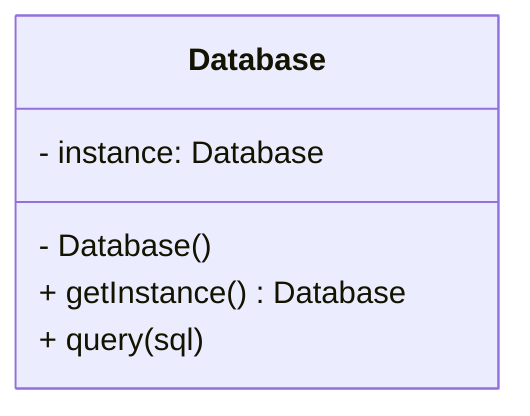

```java
class Database {
    private static Database instance;
    private Database() {} // private constructor prevents direct instantiation
    
    public static Database getInstance() {
        if (instance == null) {
            instance = new Database();
        }
        return instance;
    }
}
```
</details>

### 2. Factory Method
> **💡 The One-Liner:** "Let subclasses decide what to create."

* **Day-to-day Example:** A Logistics company. The main office (Creator) takes delivery requests, but lets the specific department (Trucking vs. Shipping) decide *which* specific vehicle (Truck vs. Ship/Product) to dispatch.
* **✅ When to use:** When you don't know beforehand the exact types and dependencies of the objects your code should work with.
* **❌ When NOT to use:** When the object creation process is simple and unlikely to change. It can unnecessarily complicate the code by adding many new subclasses.

<details>
<summary><b>Show Diagram & Code (Java)</b></summary>

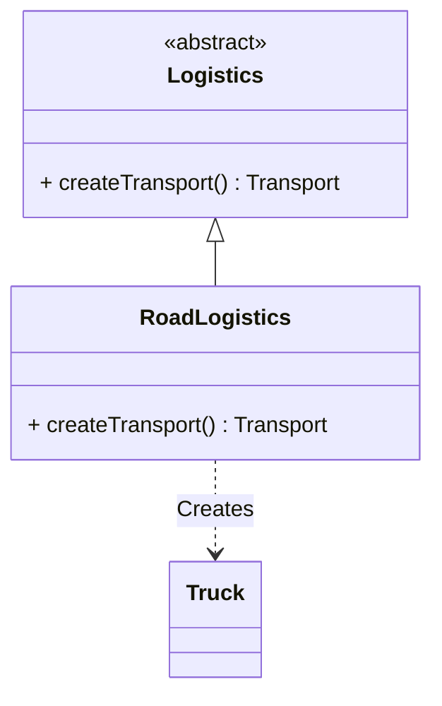

```java
abstract class Logistics {
    public void planDelivery() {
        Transport transport = createTransport();
        transport.deliver();
    }
    public abstract Transport createTransport(); // Factory Method
}

class RoadLogistics extends Logistics {
    @Override
    public Transport createTransport() {
        return new Truck();
    }
}
```
</details>

### 3. Abstract Factory
> **💡 The One-Liner:** "A factory of factories."

* **Day-to-day Example:** Purchasing furniture. If you choose "Modern Furniture Factory", you get a modern chair, modern table, and modern sofa. If you choose "Victorian Furniture Factory", all pieces match the Victorian style. You don't mix and match.
* **✅ When to use:** When your code needs to work with various *families* of related products, but you don't want it to depend on the concrete classes of those products (e.g., Cross-platform UI elements like Windows/Mac buttons).
* **❌ When NOT to use:** When you only have one family of products, or if adding new product variations isn't expected.

<details>
<summary><b>Show Diagram & Code (Java)</b></summary>

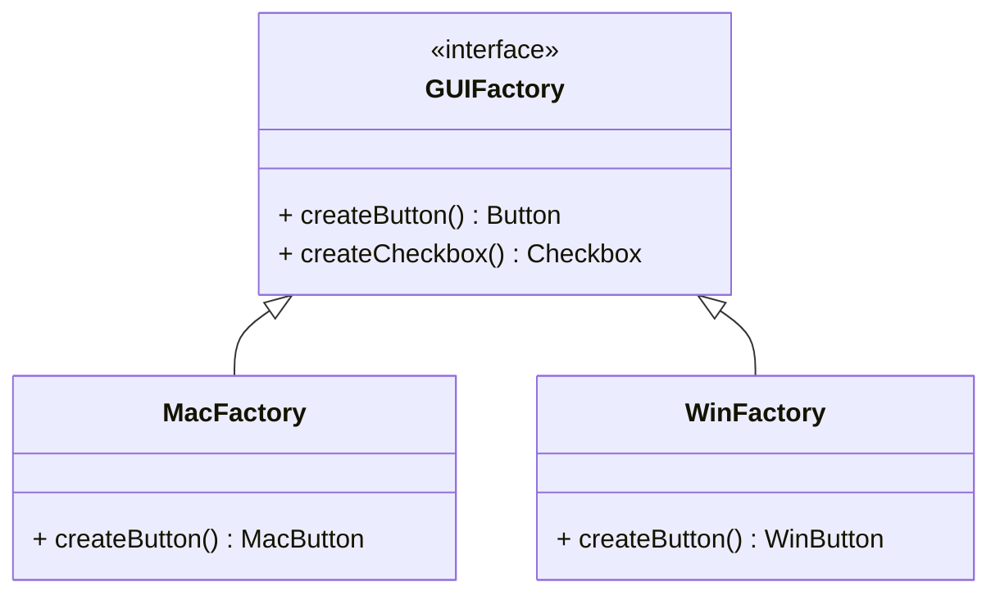

```java
interface GUIFactory {
    Button createButton();
    Checkbox createCheckbox();
}

class MacFactory implements GUIFactory {
    public Button createButton() { return new MacButton(); }
    public Checkbox createCheckbox() { return new MacCheckbox(); }
}

class WinFactory implements GUIFactory {
    public Button createButton() { return new WinButton(); }
    public Checkbox createCheckbox() { return new WinCheckbox(); }
}
```
</details>

### 4. Builder
> **💡 The One-Liner:** "Construct complex objects step by step."

* **Day-to-day Example:** Ordering a custom Pizza. You don't just say "Pizza". You say: "Add cheese, add pepperoni, make it a thin crust, no olives." The chef (Builder) constructs it step-by-step.
* **✅ When to use:** When creating an object requires a lot of initialization steps, especially when dealing with classes that have massive constructors (the "Telescoping Constructor" anti-pattern).
* **❌ When NOT to use:** For simple objects that can be created in a single step or constructor call.

<details>
<summary><b>Show Diagram & Code (Java)</b></summary>

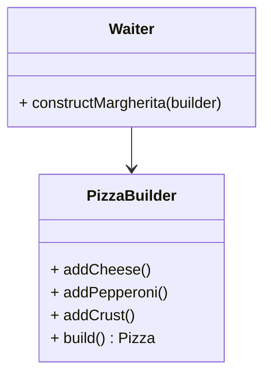

```java
class PizzaBuilder {
    private Pizza pizza = new Pizza();
    
    public PizzaBuilder addCheese() { pizza.setCheese(true); return this; }
    public PizzaBuilder addPepperoni() { pizza.setPepperoni(true); return this; }
    public Pizza build() { return pizza; }
}

// Usage:
// Pizza myPizza = new PizzaBuilder().addCheese().addPepperoni().build();
```
</details>

### 5. Prototype
> **💡 The One-Liner:** "Clone objects without coupling to their specific classes."

* **Day-to-day Example:** Cellular division (Mitosis). A cell doesn't get created from scratch by following a blueprint; an existing cell splits and creates an exact clone of itself.
* **✅ When to use:** When your code shouldn't depend on the concrete classes of objects you need to copy, or when object initialization from scratch is very expensive (e.g., heavy database reads).
* **❌ When NOT to use:** When copying the object is highly complex (e.g., it contains deep references or circular dependencies that are hard to safely duplicate).

<details>
<summary><b>Show Diagram & Code (Java)</b></summary>

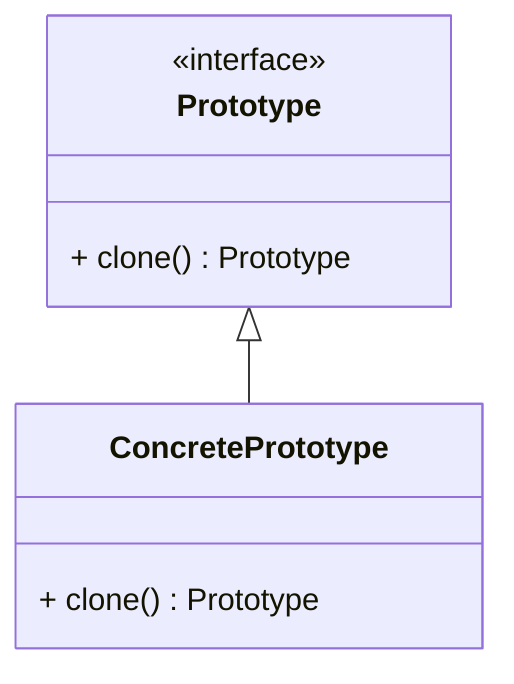

```java
class Document implements Cloneable {
    public String content, formatting;
    public Document(String content, String formatting) { 
        this.content = content; this.formatting = formatting; 
    }
    
    @Override
    public Document clone() {
        try {
            return (Document) super.clone(); // Shallow copy
        } catch (CloneNotSupportedException e) {
            return null;
        }
    }
}
```
</details>

---

## 🌉 Structural Patterns
> *How to assemble objects and classes into larger structures, while keeping these structures flexible and efficient.*

### 6. Adapter
> **💡 The One-Liner:** "Making square pegs fit into round holes."

* **Day-to-day Example:** A multi-country travel power adapter. You have a US plug (your app), but you're in Europe (third-party library with different interface). The adapter translates your US plug into round European pins.
* **✅ When to use:** When you want to use an existing class, but its interface isn't compatible with the rest of your code (often used for integrating 3rd party legacy code).
* **❌ When NOT to use:** When you can simply change the class's interface itself (i.e., you have access to modify the source code and doing so won't break other things).

<details>
<summary><b>Show Diagram & Code (Java)</b></summary>

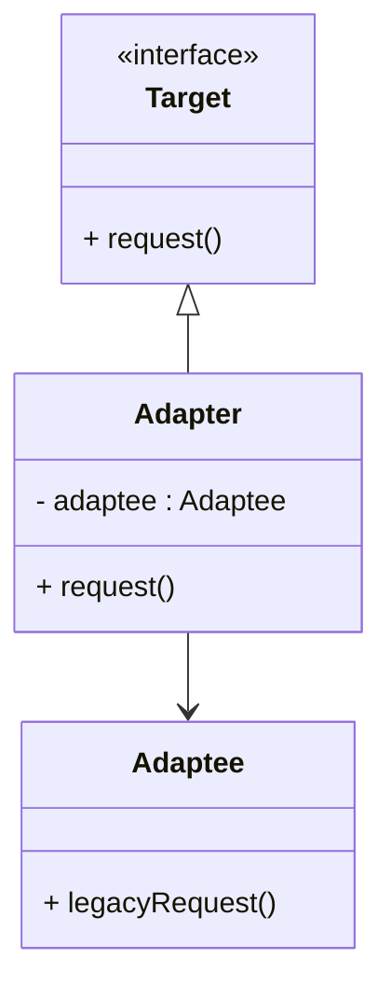

```java
class USPlug { // Old System/Third Party
    public void provide110V() {}
}

interface EuropeSocket { // What our system expects
    void receive220V();
}

class PowerAdapter implements EuropeSocket {
    private USPlug usPlug;
    
    public PowerAdapter(USPlug plug) { this.usPlug = plug; }
    
    public void receive220V() { 
        // Adapts 220 requirement to use 110V logic
        usPlug.provide110V();
    }
}
```
</details>

### 7. Bridge
> **💡 The One-Liner:** "Split a large class down the middle (Abstraction vs Implementation)."

* **Day-to-day Example:** Universal Remotes. The Remote Control (Abstraction) is separate from the TV (Implementation). You can buy a new Remote without replacing the TV, or buy a new TV and keep the Remote.
* **✅ When to use:** When you want to divide and organize a monolithic class that has multiple variants of some functionality (e.g., if the class can work with various database servers). Prevents an explosion of subclasses (e.g., `RedCircle`, `BlueCircle`, `RedSquare`, `BlueSquare`).
* **❌ When NOT to use:** For highly cohesive classes where splitting abstraction from implementation makes it artificially complex and harder to read.

<details>
<summary><b>Show Diagram & Code (Java)</b></summary>

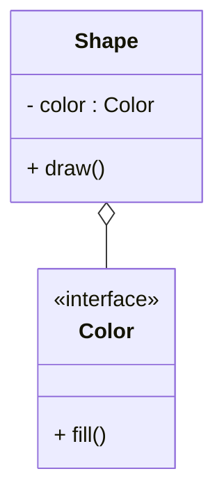

```java
interface Color { String fill(); }
class Red implements Color { public String fill() { return "Red"; } }

abstract class Shape {
    protected Color color; // The Bridge
    public Shape(Color c) { this.color = c; }
    abstract void draw();
}

class Circle extends Shape {
    public Circle(Color c) { super(c); }
    public void draw() { System.out.println("Circle in " + color.fill()); }
}
```
</details>

### 8. Composite
> **💡 The One-Liner:** "Treat individual objects and compositions uniformly (UI Trees)."

* **Day-to-day Example:** File System Directories. A Folder can contain Files, or it can contain *other* Folders. Whether you are checking the size of a single File or a Folder containing a thousand things, you call the exact same `getSize()` method.
* **✅ When to use:** When you have to implement a tree-like object structure and you want client code to treat simple objects and complex containers exactly the same way.
* **❌ When NOT to use:** When your architecture does not represent a tree/hierarchy. Forcing it into a composite makes it absurdly overly abstract.

<details>
<summary><b>Show Diagram & Code (Java)</b></summary>

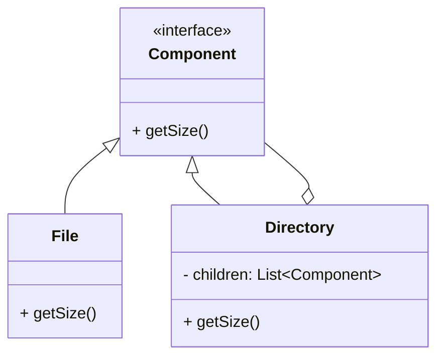

```java
interface FileSystemComponent { int getSize(); }

class File implements FileSystemComponent {
    public int getSize() { return 100; /* MB */ }
}

class Directory implements FileSystemComponent {
    private List<FileSystemComponent> children = new ArrayList<>();
    
    public void add(FileSystemComponent c) { children.add(c); }
    
    public int getSize() {
        return children.stream().mapToInt(FileSystemComponent::getSize).sum();
    }
}
```
</details>

### 9. Decorator
> **💡 The One-Liner:** "Wrap an object to add behavior on the fly."

* **Day-to-day Example:** Wearing clothes. First you're a basic Person. You put on a sweater (Decorator) -> you get warmer. You put on a raincoat (Decorator) -> you get waterproof. You are wrapping yourself in layers of functionality.
* **✅ When to use:** When you need to assign extra behaviors to objects at runtime without breaking the code that uses these objects, or as a flexible alternative to subclassing.
* **❌ When NOT to use:** When your component's core behavior heavily relies on knowing its *exact* concrete type (Decorators hide the exact type), or if creating tightly layered systems becomes a debugging nightmare.

<details>
<summary><b>Show Diagram & Code (Java)</b></summary>

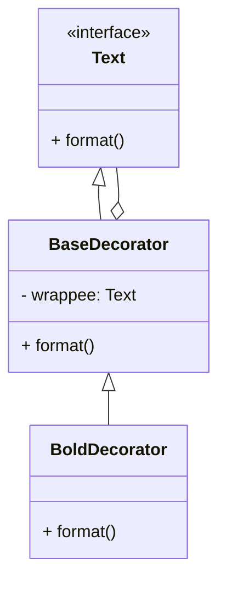

```java
interface Text { String format(); }

class PlainText implements Text {
    public String format() { return "Hello"; }
}

class BoldDecorator implements Text {
    private Text text;
    public BoldDecorator(Text t) { this.text = t; }
    
    public String format() { return "<b>" + text.format() + "</b>"; }
}
// Usage: Text t = new BoldDecorator(new PlainText());
```
</details>

### 10. Facade
> **💡 The One-Liner:** "A simple interface to a complex subsystem."

* **Day-to-day Example:** Customer Support Hotline. Instead of you calling the billing department, the shipping department, and the technical department separately, you call one number (Facade). The agent handles coordinating all the inner departments for you.
* **✅ When to use:** When you need to provide a straightforward interface to a complex framework or a legacy system with dozens of interrelated classes.
* **❌ When NOT to use:** Be careful not to let the Facade become a "God Object" paired to every single class in your app. Only expose what the client *actually needs*.

<details>
<summary><b>Show Diagram & Code (Java)</b></summary>

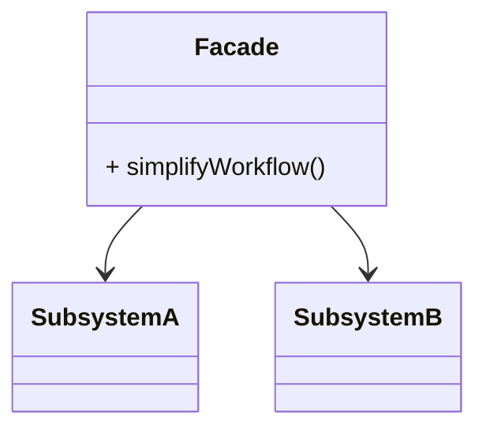

```java
class SmartHomeFacade {
    public void leaveHome() {
        new Lights().turnOffAll();
        new Thermostat().setToEcoMode();
        new SecuritySystem().arm();
        new GarageDoor().close();
    }
}

// Client just calls: new SmartHomeFacade().leaveHome();
```
</details>

### 11. Flyweight
> **💡 The One-Liner:** "Share to save RAM."

* **Day-to-day Example:** A library of books. The library doesn't keep 1,000 separate descriptions of the setting of *Harry Potter*. It just has the book (Intrinsic/Shared state). The *borrower records* and *due dates* are the Extrinsic (Unique) state held independently.
* **✅ When to use:** When your application needs to spawn millions of similar objects that end up eating all your available RAM (e.g., rendering thousands of bullets in a game, or particles).
* **❌ When NOT to use:** When memory isn't an issue. Implementing Flyweight drastically complicates the code; don't use it prematurely.

<details>
<summary><b>Show Diagram & Code (Java)</b></summary>

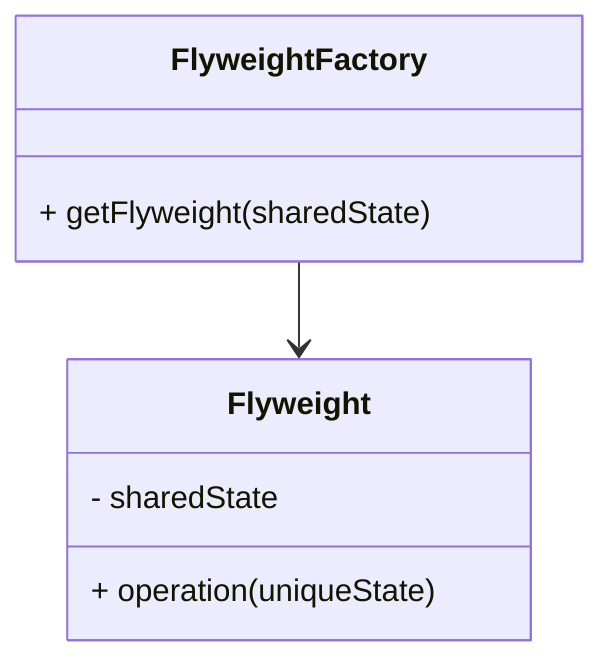

```java
// Shared, read-only state (Intrinsic)
class ParticleType { 
    String color; byte[] textureData;
    public ParticleType(String c, byte[] tex) { this.color = c; this.textureData = tex; }
}

// Unique state (Extrinsic)
class Particle { 
    int x, y, speed;
    ParticleType type; // Shared reference saves MBs/GBs of RAM
    
    public Particle(int x, int y, ParticleType type) {
        this.x = x; this.y = y; this.type = type;
    }
}
```
</details>

### 12. Proxy
> **💡 The One-Liner:** "A stand-in that controls access."

* **Day-to-day Example:** A Credit Card. It is a proxy for your bank account. It implements the same interface (can be used for payments), but sits in front of the actual cash to control access, verify PINs, and handle limits.
* **✅ When to use:** Lazy initialization (virtual proxy - load heavy objects on demand), Access Control (protection proxy), or Logging requests (logging proxy).
* **❌ When NOT to use:** When direct access to the object is fine and the proxy adds unnecessary network/latency overhead without real benefit.

<details>
<summary><b>Show Diagram & Code (Java)</b></summary>

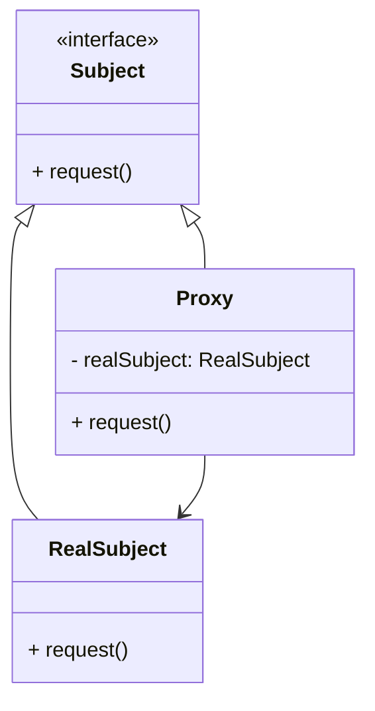

```java
interface VideoLoader { void load(); }

class RealVideoLoader implements VideoLoader {
    public void load() { System.out.println("Downloading 5GB Video..."); }
}

class ProxyVideoLoader implements VideoLoader {
    private RealVideoLoader realVideo;
    
    public void load() {
        if (realVideo == null) {
            realVideo = new RealVideoLoader(); // Lazy load
        }
        realVideo.load();
    }
}
```
</details>

---

## 🧠 Behavioral Patterns
> *Concerned with algorithms and the assignment of responsibilities between objects.*

### 13. Chain of Responsibility
> **💡 The One-Liner:** "Pass the buck down the line."

* **Day-to-day Example:** Tech Support Call. You ask the Level 1 agent. They can't help, so they pass you to Level 2. Level 2 can't help, so they pass you to Level 3.
* **✅ When to use:** When your program is expected to process different kinds of requests in various ways, but the exact types of requests and their sequences are unknown beforehand (e.g., Express.js middlewares, UI event bubbling).
* **❌ When NOT to use:** When a request MUST be handled. In a chain, a request can easily reach the end unhandled and be silently dropped.

<details>
<summary><b>Show Diagram & Code (Java)</b></summary>

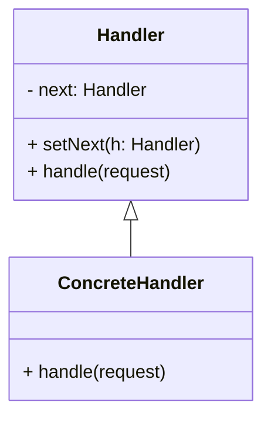

```java
abstract class SupportHandler {
    protected SupportHandler next;
    
    public void setNext(SupportHandler handler) { this.next = handler; }
    public abstract void handle(String issue);
}

class L1Support extends SupportHandler {
    public void handle(String issue) {
        if (issue.equals("PasswordReset")) {
            System.out.println("L1 Fixed Issue.");
        } else if (next != null) {
            next.handle(issue); // Passed down the chain
        }
    }
}
```
</details>

### 14. Command
> **💡 The One-Liner:** "Encapsulate a request as an object."

* **Day-to-day Example:** Ordering food at a restaurant. Your verbal order is written down on a piece of paper (the Command). This paper is queued, passed to the kitchen, and eventually executed.
* **✅ When to use:** When you need reversible operations (undo/redo), when you need to schedule execution of operations (queues), or parametrizing objects with operations.
* **❌ When NOT to use:** When you're just calling a simple method. Wrapping it in a Command injects overhead and layers of classes.

<details>
<summary><b>Show Diagram & Code (Java)</b></summary>

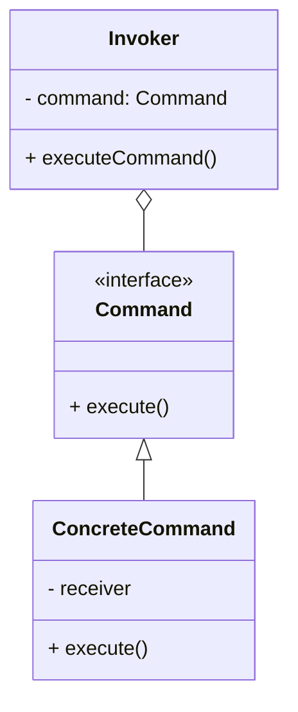

```java
interface Command { void execute(); void undo(); }

class CopyCommand implements Command {
    private String backup;
    public void execute() { backup = "copied text"; }
    public void undo() { backup = ""; }
}
```
</details>

### 15. Iterator
> **💡 The One-Liner:** "Traverse without exposing how the collection is built."

* **Day-to-day Example:** A TV Remote. Pressing 'Next Channel' traverses the list of channels. You don't need to know if the TV stores the channels in an array, a linked list, or a tree structure.
* **✅ When to use:** When your collection has a complex data structure under the hood, but you want to hide its complexity from clients.
* **❌ When NOT to use:** For simple arrays or lists where a standard `for` loop is perfectly adequate and more performant.

<details>
<summary><b>Show Diagram & Code (Java)</b></summary>

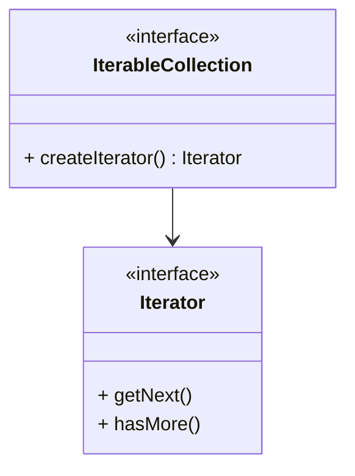

```java
class UserCollection implements Iterable<User> {
    private List<User> users = new ArrayList<>();
    
    @Override
    public Iterator<User> iterator() { 
        return users.iterator(); // Exposes the standard traversal method uniformly
    }
}
```
</details>

### 16. Mediator
> **💡 The One-Liner:** "The air traffic controller."

* **Day-to-day Example:** Air Traffic Control Tower. Airplanes don't communicate directly with each other to avoid crashing; they communicate exclusively with the tower, which orchestrates them.
* **✅ When to use:** When it's hard to change some of the classes because they are tightly coupled to a bunch of other classes (the "spaghetti" UI layout problem).
* **❌ When NOT to use:** It can slowly become a God Object knowing too much about your application, centralizing complexity rather than resolving it.

<details>
<summary><b>Show Diagram & Code (Java)</b></summary>

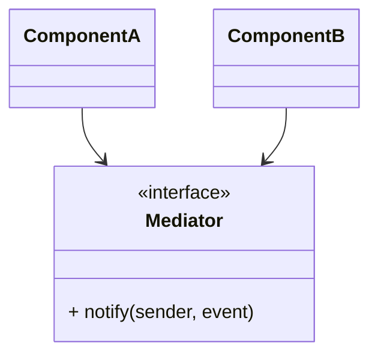

```java
interface Mediator {
    void notify(Object sender, String event);
}

class ChatRoomMediator implements Mediator {
    public void notify(Object sender, String event) {
        if (event.equals("send_message")) {
            System.out.println("Broadcasting message securely.");
        }
    }
}
```
</details>

### 17. Memento
> **💡 The One-Liner:** "Save snapshots to restore later."

* **Day-to-day Example:** Video game save files. Before fighting a boss, you save the game. The save file (Memento) captures all your stats. If you die, you just load the save file to restore your state.
* **✅ When to use:** When you need a direct snapshot of the object’s state to be able to restore a previous state of the object (Undo mechanics).
* **❌ When NOT to use:** If objects store massive amounts of data, creating mementos frequently will cause RAM and performance issues.

<details>
<summary><b>Show Diagram & Code (Java)</b></summary>

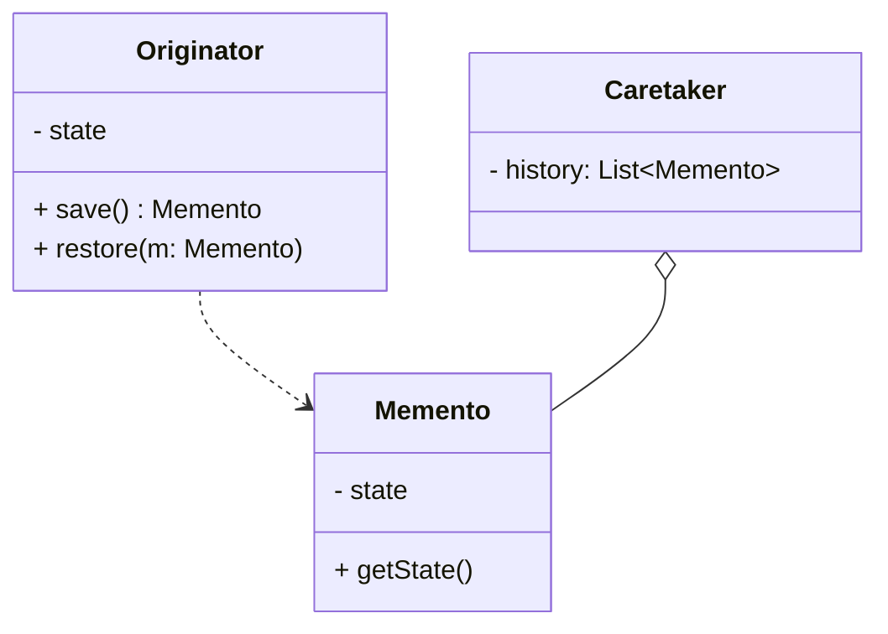

```java
class Memento {
    public final String savedState; // Immutable
    public Memento(String state) { this.savedState = state; }
}

class Editor { 
    private String text;
    
    public Memento save() { return new Memento(text); }
    public void restore(Memento memento) { this.text = memento.savedState; }
}
```
</details>

### 18. Observer
> **💡 The One-Liner:** "Tell me when something changes!"

* **Day-to-day Example:** YouTube Subscriptions. You don't go to a channel every 5 minutes to check if a new video is posted. You subscribe, and YouTube pushes a notification to you (and every other subscriber) the moment a video drops.
* **✅ When to use:** When changes to the state of one object may require changing other objects, and the actual set of objects is unknown beforehand or changes dynamically (RxJS, Event Listeners).
* **❌ When NOT to use:** Subscribers are notified in random order. If you need rigid sequential processing, Observer makes debugging a nightmare. Also beware of memory leaks if subscribers aren't unregistered.

<details>
<summary><b>Show Diagram & Code (Java)</b></summary>

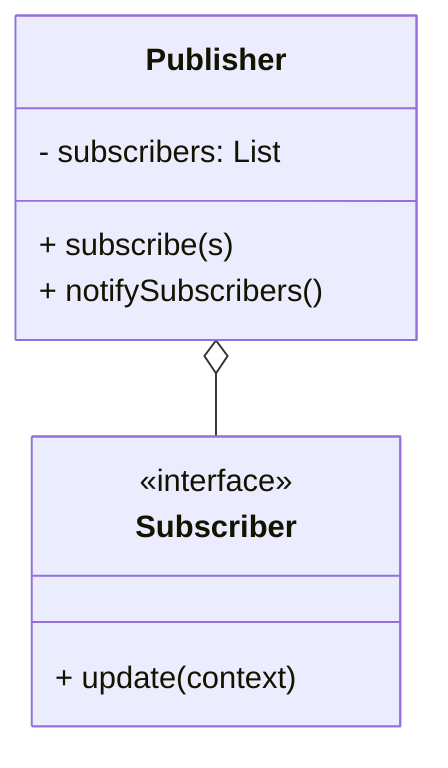

```java
interface Subscriber { void update(String event); }

class Publisher {
    private List<Subscriber> subscribers = new ArrayList<>();
    
    public void subscribe(Subscriber sub) { subscribers.add(sub); }
    
    public void notifySubscribers(String event) {
        for (Subscriber sub : subscribers) { sub.update(event); }
    }
}
```
</details>

### 19. State
> **💡 The One-Liner:** "Change behavior based on internal state."

* **Day-to-day Example:** A Smartphone. If you press the power button while it's unlocked, it locks the screen. If you press it while it's locked, it wakes up the screen. The behavior of the button completely changes based on the phone's *state*.
* **✅ When to use:** When you have an object that behaves differently depending on its current state, and the state-specific code consists of massive `if-else` or `switch` statements.
* **❌ When NOT to use:** If a state machine has only a few states or rarely changes, extracting it into separate classes is overkill.

<details>
<summary><b>Show Diagram & Code (Java)</b></summary>

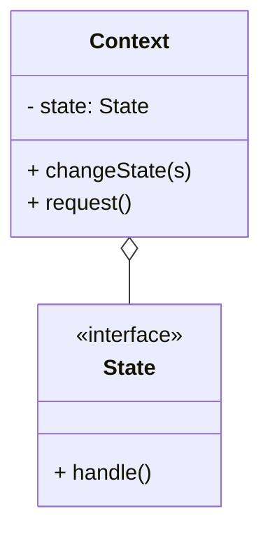

```java
interface State { void pressButton(Phone phone); }

class LockedState implements State {
    public void pressButton(Phone phone) { phone.setState(new UnlockedState()); }
}

class Phone {
    private State state = new LockedState();
    
    public void setState(State state) { this.state = state; }
    public void buttonPressed() { state.pressButton(this); }
}
```
</details>

### 20. Strategy
> **💡 The One-Liner:** "Swap algorithms on the fly."

* **Day-to-day Example:** Navigating via Google Maps. Do you want to go by Car? By Bus? By Walking? The start point and end point are the same, but you plug in a different Route Strategy to calculate the path.
* **✅ When to use:** When you want to use different variants of an algorithm within an object and be able to switch from one algorithm to another during runtime.
* **❌ When NOT to use:** If you only have a couple of algorithms and they rarely change, putting them into heavily abstracted functional components adds unnecessary code complexity (a simple `switch` statement might be fine).

<details>
<summary><b>Show Diagram & Code (Java)</b></summary>

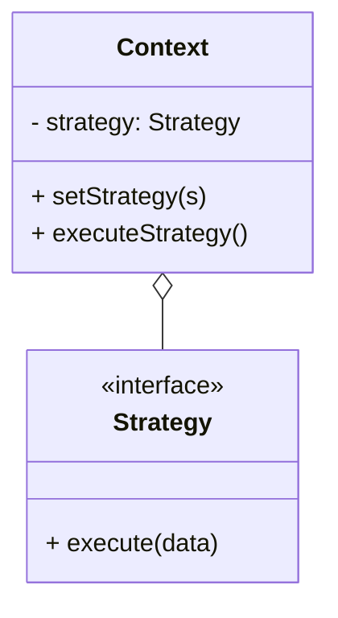

```java
interface PaymentStrategy { void pay(int amount); }

class CreditCardStrategy implements PaymentStrategy { 
    public void pay(int amount) { /* Logic */ }
}
class PaypalStrategy implements PaymentStrategy { 
    public void pay(int amount) { /* Logic */ }
}

class ShoppingCart {
    public void checkout(int amount, PaymentStrategy strategy) {
        strategy.pay(amount); // Strategy swapped at runtime
    }
}
```
</details>

### 21. Template Method
> **💡 The One-Liner:** "Define a skeleton, let subclasses fill the steps."

* **Day-to-day Example:** Building a house plan. The architect defines the Template: "1. Build Foundation, 2. Build Walls, 3. Build Roof." Builders cannot change the order, but a wooden house builder will do Step 2 differently than a brick house builder.
* **✅ When to use:** When you want to let clients extend only particular steps of an algorithm, but not the whole algorithm or its structure.
* **❌ When NOT to use:** Algorithms with many steps become tedious to maintain using this pattern. It might violate the Liskov Substitution Principle if subclasses suppress base default implementations.

<details>
<summary><b>Show Diagram & Code (Java)</b></summary>

```mermaid
classDiagram
    class AbstractClass {
        + templateMethod()
        + step1()
        + step2()*
    }
    class ConcreteClass {
        + step2()
    }
    AbstractClass <|-- ConcreteClass
```

```java
abstract class Builder {
    // Template Method
    public final void buildHouse() {
        buildFoundation();
        buildWalls(); // Subclasses implement this
        buildRoof();
    }
    
    private void buildFoundation() { System.out.println("Foundation laid"); }
    protected abstract void buildWalls();
    private void buildRoof() { System.out.println("Roof built"); }
}
```
</details>

### 22. Visitor
> **💡 The One-Liner:** "Add operations to classes without altering them."

* **Day-to-day Example:** An Insurance Agent (Visitor). The agent comes to a House, visits a Car, and visits a Business. The agent does a different assessment for each. The Car and House objects don't contain the insurance logic—the Agent carries that logic with them.
* **✅ When to use:** When you need to perform an operation on all elements of a complex object structure (for instance, an object tree / AST), but you don't want or can't alter those elements.
* **❌ When NOT to use:** When the class hierarchy changes frequently. Every time a new class gets added to the hierarchy, every single Visitor class must be updated to support the new element.

<details>
<summary><b>Show Diagram & Code (Java)</b></summary>

```mermaid
classDiagram
    class Element {
        <<interface>>
        + accept(v: Visitor)
    }
    class Node {
        + accept(v: Visitor)
    }
    class Visitor {
        <<interface>>
        + visitNode(n: Node)
    }
    Element <|-- Node
    Node ..> Visitor
```

```java
interface Visitor {
    void visitCar(Car car);
    void visitHouse(House house);
}

interface ItemElement { void accept(Visitor visitor); }

class Car implements ItemElement {
    public void accept(Visitor visitor) { visitor.visitCar(this); }
}

class InsuranceAgent implements Visitor {
    public void visitCar(Car car) { System.out.println("Insuring car..."); }
    public void visitHouse(House house) { System.out.println("Insuring house..."); }
}
```
</details>

---
<div align="center"><i>Happy coding and good luck with learning Design Patterns!</i> 🎉</div>
